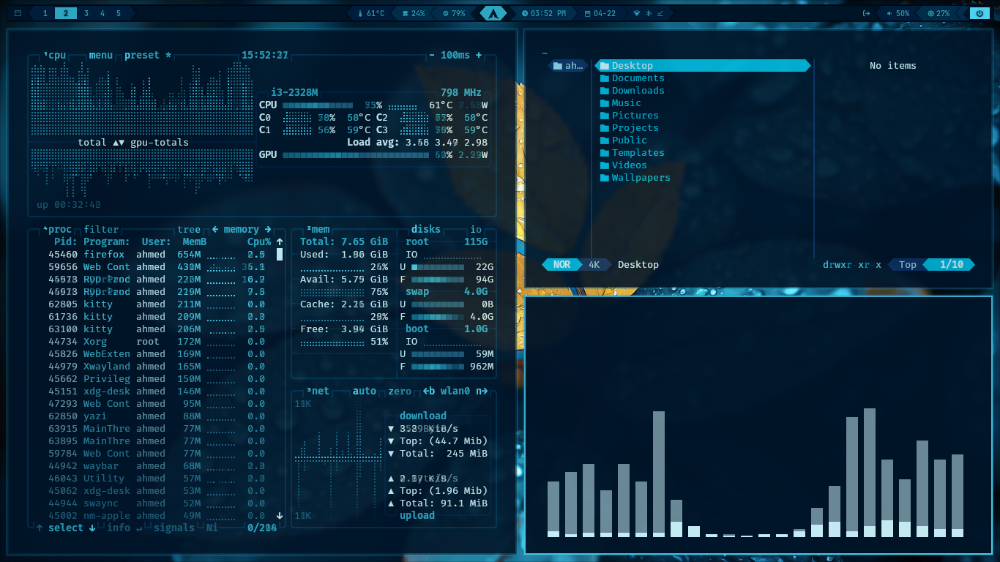
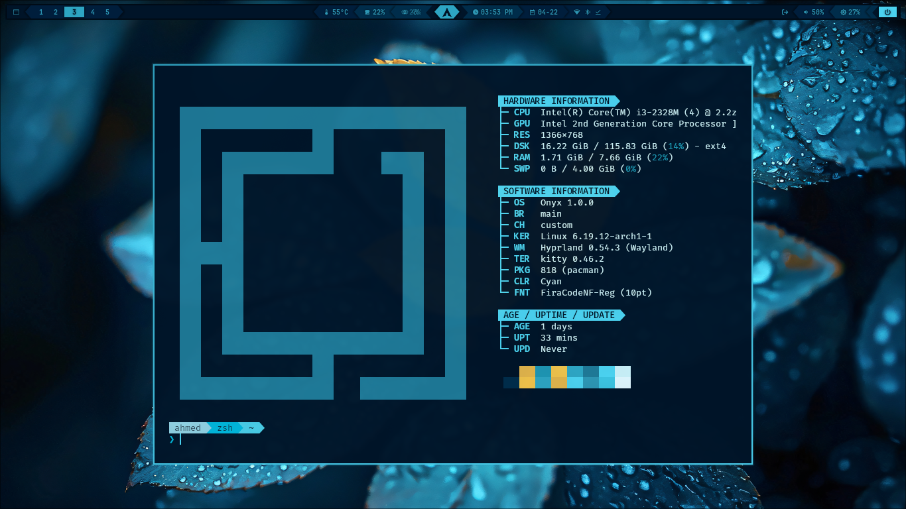
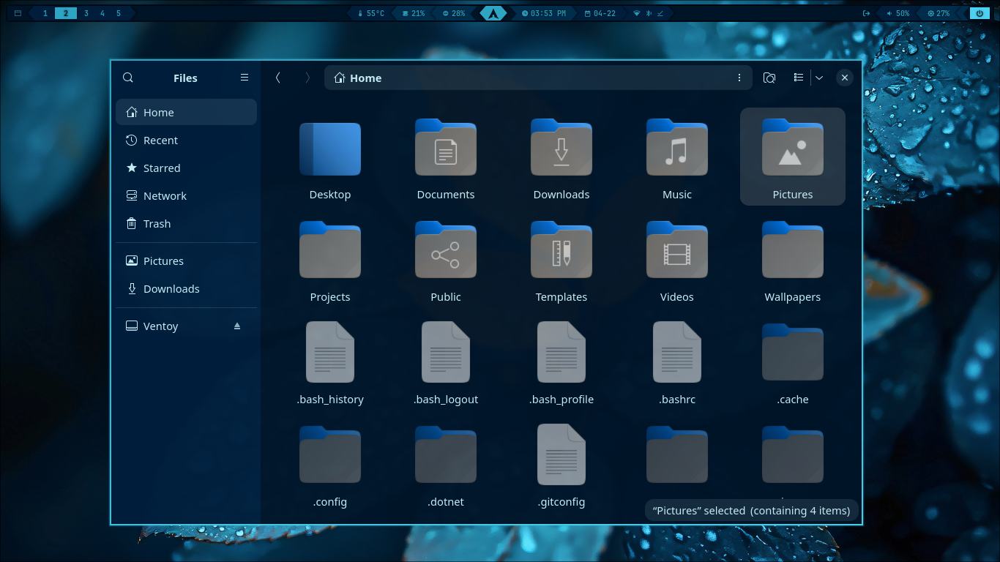
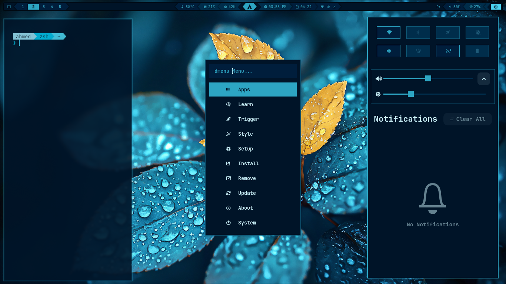

# ONYX Dotfiles






A personal Hyprland setup — clean, fast, and themeable.

---

## 🖥️ Components

| Component | Tool |
|-----------|------|
| Compositor | Hyprland |
| Bar | Waybar |
| Launcher | Rofi (wayland) |
| Terminal | Kitty |
| Notifications | SwayNC |
| Wallpaper | awww |
| Lock Screen | Hyprlock + Hypridle |
| Shell | Zsh |
| Shell Prompt | Starship |
| File Manager | Nautilus |
| Clipboard | cliphist |
| System Monitor | btop |
| Visualizer | cava |
| File Previewer | ctpv |
| ls replacement | lsd |
| Night Light | hyprsunset |
| Multiplexer | tmux |
| File Manager (TUI) | yazi |
| Fetch | fastfetch |
| Screenshot Editor | Satty |
| Screen Recorder | gpu-screen-recorder |
| Login Screen | SDDM (sddm-astronaut-theme) |

---

## ✨ Features

### 🎨 Theme System

**Available themes:** `Void Purple` · `Deep Cyan` · `Sakura Pink` · `Lavender` · `Sky Blue` · `Inferno`

Applies to: Waybar · SwayNC · Kitty · Rofi · btop · cava · Starship · Window borders · Wallpaper · Icons · GTK

#### مبني على نظام colors.toml + Templates
كل ثيم ملف واحد `colors.toml` يحتوي على جميع الألوان. عند تطبيق الثيم يقوم `theme-set.sh` بتوليد ملفات الإعداد تلقائياً من القوالب في `themes/templates/`.

```bash
# تطبيق ثيم مباشرة من الطرفية
~/.config/hypr/scripts/theme-set.sh void_purple
~/.config/hypr/scripts/theme-set.sh sky_blue

# أو من Rofi: Super + Space → Style → Theme
```

#### إضافة ثيم جديد
```bash
mkdir -p ~/.config/themes/dark/my_theme
# أنشئ colors.toml فقط — النظام يولّد الباقي تلقائياً
```

---

### 🖥️ SDDM Login Screen

**Available themes:** `Japanese Aesthetic`

---

### 󰸉 Wallpaper Menu (`Super + I`)

Change desktop wallpaper from `~/Pictures/Wallpapers/` with thumbnail previews.

---

### 󰅍 Clipboard
- `Super + C` — Text clipboard
- `Super + Shift + C` — Image clipboard with thumbnails

---

### 󰷛 Lock Screen (`Super + Shift + X`)
- Blurred screenshot as background
- Time and date centered with Electroharmonix font
- Password input field with sharp corners

---

### 󰀻 Rofi Main Menu (`Super + Space`)

| Option | Function |
|--------|----------|
| Apps | Full app launcher |
| Install | Install packages (Pacman / AUR) |
| Remove | Remove packages |
| Update | Update system |
| Wallpaper | Change wallpaper |
| Style | Themes · SDDM Theme |
| About | System info |
| System | Lock · Logout · Suspend · Reboot · Shutdown |

---

### 󰤨 Wi-Fi & Bluetooth Menus
- **Wi-Fi menu** — connect to networks directly from Rofi
- **Bluetooth menu** — manage paired devices from Rofi
- Access via `Super + Space` → dedicated menus or Waybar click

---

### 󰝚 Now Playing (`Super + O`)
Media player controls in a floating Rofi overlay — shows current track, play/pause, next/previous.

---

### 🌙 Night Light (hyprsunset)
Toggle warm color temperature with `Super + Shift + N` or `Super + F7`.

---

### 󰌆 File Manager (`Super + E`)
Opens Nautilus file manager.

---

### 🪟 Window Groups (Tabbed Windows)
- `Super + G` — Toggle window group
- `Super + Alt + G` — Move window out of group
- `Super + Alt + Tab` / `Super + Ctrl + Left/Right` — Cycle group tabs

---

### 📌 Scratchpad
- `Super + S` — Toggle scratchpad
- `Super + Alt + S` — Move window to scratchpad

---

## ⚙️ Installation

```bash
git clone https://github.com/2b-3c/dotfiles
cd dotfiles
bash install.sh
```

> The installer handles everything: packages, configs, permissions, services, and applies Black Hole as the default theme.

### Manual

```bash
git clone https://github.com/2b-3c/dotfiles
cd dotfiles

cp -r .config/* ~/.config/
mkdir -p ~/Pictures/Screenshots ~/Pictures/Wallpapers ~/Videos

find ~/.config/rofi/scripts      -type f -name "*.sh" -exec chmod +x {} +
find ~/.config/waybar/scripts    -type f               -exec chmod +x {} +
find ~/.config/swaync/scripts    -type f -name "*.sh" -exec chmod +x {} +
find ~/.config/hypr/scripts      -type f -name "*.sh" -exec chmod +x {} +
find ~/.config/fastfetch/scripts -type f -name "*.sh" -exec chmod +x {} +
```

---

## 📦 Dependencies

### Core
```
hyprland hyprlock hypridle hyprsunset
xdg-desktop-portal-hyprland xdg-desktop-portal-gtk xorg-xwayland
grim slurp grimblast-git awww wl-clipboard imagemagick iw
hyprpolkitagent
```

### Audio
```
pipewire pipewire-pulse pipewire-alsa wireplumber
pamixer playerctl libpulse wiremix python-gobject
```

### Network
```
networkmanager network-manager-applet
bluez bluez-utils bluetui impala rfkill
```

### UI
```
waybar python python-requests pacman-contrib upower jq curl
rofi-wayland rofi-emoji
swaync
brightnessctl libnotify
```

### Applications
```
kitty firefox nautilus
btop fastfetch cava gum
tmux starship zsh lsd bat neovim yazi
fd ripgrep p7zip ffmpeg ffplay rsync
ffmpegthumbnailer perl-image-exiftool
satty gpu-screen-recorder v4l-utils v4l2loopback-dkms linux-headers
hyprpicker cliphist fzf zoxide
```

### Fonts & Icons
```
ttf-firacode-nerd ttf-jetbrains-mono-nerd
noto-fonts noto-fonts-emoji
yaru-icon-theme bibata-cursor-theme
```

### SDDM
```
sddm qt6-svg qt6-virtualkeyboard qt6-multimedia-ffmpeg
```

> The `Electroharmonix` font used in the lock screen is bundled in `sddm-theme/Fonts/`.

---

## ⌨️ Keybindings

> `$mod` = Super

### Menus

| Shortcut | Action |
|----------|--------|
| `Super + Space` | Main menu |
| `Super + A` | App launcher |
| `Super + R` | Run launcher |
| `Super + C` | Text clipboard |
| `Super + Shift + C` | Image clipboard |
| `Super + .` | Emoji picker |
| `Super + W` | Window switcher |
| `Super + O` | Now Playing |
| `Super + I` | Wallpaper selector |

### Applications

| Shortcut | Action |
|----------|--------|
| `Super + T` | Terminal (Kitty) |
| `Super + E` | File manager (Nautilus) |
| `Super + F` | Browser (Firefox) |
| `Super + N` | Toggle notifications |

### Screenshots

| Shortcut | Action |
|----------|--------|
| `Print` | Smart screenshot (click window or draw region) |
| `Super + Print` | Full screen screenshot |
| `Ctrl + Super + Print` | Window snap screenshot |
| `Super + Shift + S` | Region screenshot to clipboard only |

> Screenshots are saved to `~/Pictures/Screenshots/` and copied to clipboard. A notification with an **Edit** button opens Satty for annotation.

### Screen Recording

| Shortcut | Action |
|----------|--------|
| `Super + Shift + R` | Start / stop screen recording |
| `Super + Shift + Alt + R` | Start recording with desktop + mic audio |

> Recordings are saved to `~/Videos/`.

### Audio

| Shortcut | Action |
|----------|--------|
| `XF86AudioRaiseVolume` | Volume up |
| `XF86AudioLowerVolume` | Volume down |
| `XF86AudioMute` | Mute |
| `XF86AudioMicMute` | Mute microphone |
| `XF86AudioPlay/Pause` | Play/Pause |
| `XF86AudioNext/Prev` | Next/Previous track |
| `Super + XF86AudioMute` | Switch audio output device |

### Brightness

| Shortcut | Action |
|----------|--------|
| `XF86MonBrightnessUp/Down` | Brightness up/down |

### Display & Layout

| Shortcut | Action |
|----------|--------|
| `Super + F8` | Cycle monitor scaling |
| `Super + Shift + F8` | Toggle single-window square aspect ratio |
| `Super + Shift + N` / `Super + F7` | Toggle night light (hyprsunset) |
| `Super + L` | Toggle workspace layout (dwindle ↔ master) |
| `Super + Backspace` | Toggle window transparency |
| `Super + Shift + Backspace` | Toggle window gaps |

### Window Management

| Shortcut | Action |
|----------|--------|
| `Super + Q` | Close window |
| `Super + V` | Toggle floating |
| `Super + P` | Toggle pseudo-tiling |
| `Super + J` | Toggle split |
| `Super + F11` | Full screen |
| `Super + U` | Pop window out (float + pin) |
| `Super + Arrows` | Move focus |
| `Super + Shift + Arrows` | Swap window |
| `Super + [-] / [=]` | Resize window horizontally |
| `Super + Shift + [-] / [=]` | Resize window vertically |
| `Super + Mouse drag` | Move window |
| `Super + Right Click` | Resize window |
| `Alt + Tab` | Cycle to next window |
| `Alt + Shift + Tab` | Cycle to previous window |

### Window Groups (Tabbed)

| Shortcut | Action |
|----------|--------|
| `Super + G` | Toggle window group |
| `Super + Alt + G` | Move window out of group |
| `Super + Alt + Tab` | Next window in group |
| `Super + Alt + Shift + Tab` | Previous window in group |
| `Super + Ctrl + Left/Right` | Cycle group tabs |
| `Super + Alt + Arrows` | Move window into adjacent group |

### Workspaces

| Shortcut | Action |
|----------|--------|
| `Super + 1-0` | Switch to workspace 1-10 |
| `Super + Shift + 1-0` | Move window to workspace |
| `Super + Shift + Alt + 1-0` | Move window silently to workspace |
| `Super + TAB` | Next workspace |
| `Super + Shift + TAB` | Previous workspace |
| `Super + Ctrl + TAB` | Former workspace |
| `Super + Scroll` | Switch workspaces |
| `Super + Shift + Alt + Arrows` | Move workspace to another monitor |
| `Super + S` | Toggle scratchpad |
| `Super + Alt + S` | Move window to scratchpad |

### System

| Shortcut | Action |
|----------|--------|
| `Super + Shift + X` | Lock screen |
| `Super + Shift + B` | Restart Waybar |
| `Super + Shift + M` | Exit Hyprland |

---

## 📁 File Structure

```
~/.config/
├── hypr/
│   ├── hyprland.conf
│   ├── hyprlock.conf
│   ├── hypridle.conf
│   ├── autostart.conf
│   ├── bindings.conf
│   ├── colors.conf
│   ├── env.conf
│   ├── input.conf
│   ├── looknfeel.conf
│   ├── monitors.conf
│   ├── windowrules.conf
│   ├── xdph.conf
│   └── scripts/
│
├── waybar/
│   ├── config.jsonc
│   ├── style.css
│   ├── theme.css
│   ├── themes/  (black_hole · cyan)
│   └── scripts/
│
├── rofi/
│   ├── app-launcher.rasi
│   ├── bluetooth.rasi
│   ├── clipboard.rasi
│   ├── config.rasi
│   ├── emoji.rasi
│   ├── image-clipboard.rasi
│   ├── launcher-menu.rasi
│   ├── logout-menu.rasi
│   ├── nowplaying/
│   ├── run-launcher.rasi
│   ├── wallpaper-select.rasi
│   ├── wifi.rasi
│   ├── wifi-bluetooth-menu.rasi
│   ├── window-switcher.rasi
│   ├── themes/  (black_hole · cyan)
│   └── scripts/
│
├── swaync/
│   ├── config.json
│   ├── style.css
│   ├── theme.css
│   ├── themes/  (black_hole · cyan)
│   └── scripts/
│
├── kitty/
│   ├── kitty.conf
│   ├── theme.conf
│   └── themes/  (black_hole · cyan)
│
├── btop/
│   ├── btop.conf
│   └── themes/  (black_hole · cyan)
│
├── cava/
│   ├── config
│   └── themes/  (black_hole · cyan)
│
├── starship/
│   ├── theme.toml
│   └── themes/  (black_hole · cyan)
│
├── fastfetch/
│   ├── config.jsonc
│   ├── onyx.txt
│   └── scripts/
│
├── yazi/
│   ├── yazi.toml
│   ├── keymap.toml
│   ├── theme.toml
│   └── themes/  (black_hole · cyan)
│
├── ctpv/config
├── lsd/config.yaml
├── tmux/tmux.conf
│
├── icons-themes/
│   ├── black_hole
│   └── cyan
│
├── gtk-3.0/
│   ├── gtk.css · settings.ini
│   └── themes/  (black_hole · cyan)
│
└── gtk-4.0/
    ├── gtk.css · settings.ini
    └── themes/  (black_hole · cyan)

~/
├── .zshrc
├── .gitconfig
├── Videos/
├── Pictures/
│   ├── Screenshots/
│   └── Wallpapers/themes/
│       ├── black_hole.png
│       └── cyan.jpg
│
└── dotfiles/
    └── sddm-theme/
        ├── Main.qml
        ├── Components/
        ├── Assets/
        ├── Fonts/
        ├── Themes/  (japanese_aesthetic)
        └── Backgrounds/  (japanese_aesthetic)
```

---

## ⚠️ Manual Configuration After Install

| File | What to Edit |
|------|-------------|
| `~/.config/hypr/monitors.conf` | Monitor name, resolution, and refresh rate |
| `~/.config/hypr/input.conf` | Keyboard layout and mouse settings |
| `~/.config/hypr/hyprland.conf` | Default terminal, browser, or file manager |

---

## 📝 Notes

- Default theme: **Black Hole** — applied automatically on install
- Screenshots are saved to `~/Pictures/Screenshots/`
- A config backup is saved to `~/.config_backup_*` on every install
- Wallpaper is restored automatically on every boot via `restore_wallpaper.sh`
- Hyprland config is split into sub-files — edit each section in its own file
- Night light toggled via `Super + Shift + N` or `Super + F7`
- The `Electroharmonix` font (used in lock screen) is bundled in `sddm-theme/Fonts/`
- Zsh plugins (autosuggestions, syntax-highlighting, history-substring-search) are bundled in `~/.config/zsh/`

---

## 🤝 Contributing

Suggestions and fixes are welcome — open an Issue or PR.

---

## 🆕 New in This Version

### 🔋 Battery Monitor
- Automatic low battery alert at 10% via systemd timer (every 30s)
- Add `~/.config/onyx/hooks/battery-low` to play a sound or run custom actions

### 🪝 Hooks System
Add scripts to `~/.config/onyx/hooks/` for custom actions at key events:

| Hook file       | Triggered when              |
|-----------------|-----------------------------|
| `battery-low`   | Battery reaches 10%         |
| `theme-set`     | A theme is applied          |
| `font-set`      | The font is changed         |
| `post-update`   | After system update         |

Sample files (with `.sample` extension) are provided as starting points.

### 📦 Migrations
Config changes between versions are handled automatically via `migrations/`.
State is tracked in `~/.local/state/onyx/migrations/`.

### 🐛 Debug Tool
```bash
~/.config/hypr/scripts/debug.sh
```
Collects system info, logs, and installed packages. Can upload to 0x0.st for sharing.

### ⚡ Power Profiles
```bash
~/.config/hypr/scripts/powerprofiles-set.sh toggle   # performance ↔ balanced
~/.config/hypr/scripts/powerprofiles-set.sh ac        # set performance on AC
~/.config/hypr/scripts/powerprofiles-set.sh battery   # set balanced on battery
```

### 📺 Waybar Indicators
New live indicators in `~/.config/waybar/scripts/`:
- `screen-recording.sh` — shows 󰻂 while recording
- `idle-indicator.sh` — shows 󱫖 when auto-lock is off
- `notification-silencing.sh` — shows 󰂛 in DND mode
- `nightlight-indicator.sh` — shows  when night light is on

